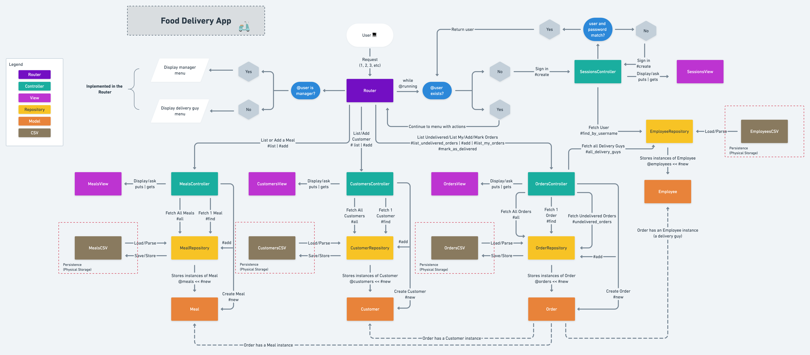

Time to build a Food Delivery program for a restaurant.

The software is designed for **one restaurant only**, so no need to cater (no pun intended 😉) for a multi-restaurant one (e.g. you don't need a `Restaurant` model).

The main components are:

- **Employees** (managers, delivery guys)
- **Customers** of the Restaurant
- **Meals** that can be ordered
- **Orders** made by customers, and assigned to a given delivery guy.



## 1 - (`Meal`)

Your restaurant sells food, so you need a way to store the meals that can be ordered. Each meal has a name and a price. Write some code to model this, and create a repository that will read/write the meals from a CSV.

Then let's move to the controller. Here are the **user actions** we want to implement:

- `List` all meals available in the restaurant
- `Add` a new meal

The `rake` should help you go through all these steps. Follow your guide!

To launch `rake` for just the meal section, use `rspec -t meal`

Done? Good! Time to `commit` and `push`.

## 2 - We need a router!

We haven't launched our app code yet. To do this, we need a router and a `run` method. If you're stuck, go back to the **Cookbook** code to get some inspiration. Make sure that you can run the two meal-related user actions when launching the program:

```bash
ruby app.rb
```

Done? Good! Time to `commit` and `push`.

## 3 - (`Customer`)

We need to keep a list of all our customers. When a new customer calls to order, the first thing we need to do is add them to our list. Each customer has a name and an address. Work on the model, the repository to store the CSV (it's a different file than `meals.csv`!) and finally the controller to implement the following user actions:

- `List` all customers available in the restaurant
- `Add` a new customer

Once your controller methods are implemented, add them to the router! Make sure your 4 user actions work before moving on to the next feature.

```bash
ruby app.rb
```

To launch `rake` for just the customer tests, use `rspec -t customer`

Done? Boom! Don't forget to `commit` and `push`.

## 4 - (Optional) Inheritance to the rescue

`MealRepository` and `CustomerRepository` have a lot of similarities don't they? We should always stay [DRY](https://en.wikipedia.org/wiki/Don%27t_repeat_yourself), so it's time to introduce a parent class, `BaseRepository`, which will hold all of the shared behavior.

Reminder: this is an optional section, so you can skip it and come back to it later if you want.

## 5 - (`Employee`)

The restaurant has two types of employees, **managers** and **delivery guys**. We want to implement a **read-only** logic for `EmployeeRepository` from a CSV file that we fill manually (no need for an `add` action).

Open your `employees.csv` file and manually add some employees:

```bash
id,username,password,role
1,paul,secret,manager
2,john,secret,delivery_guy
```

With that information, we can implement a **login** logic in our app to have two dashboards in the router depending on the user role: one dashboard for the manager, and another dashboard for the delivery guy (with fewer user actions available).

To handle that, we'll introduce the notion of a **session**. At the router level, we'll store the logged-in user in a session.

The sign sequence should go like this:

```bash
> username?
paul
> password?
blablabla
Wrong credentials... Try again!
> username?
paul
> password?
secret
Welcome Paul!
```

Now when you run the food delivery app, the first thing you can do is to **sign in**. The dashboard that you then see should be **dependent on your role**:

```bash
ruby app.rb
```
Optional: At the moment, a user's password is stored straight in the CSV and is visible to anyone. Is that a good idea? What could we do instead?

To launch only employee tests, use `rspec -t employee`

Finished? Great work :) Remember to `commit` and `push`.


## 6 - (`Order`) Time to link all the models!

An order is taken for a **customer**, containing a **meal** (to simplify things, let's say that an order can only contain **one meal**) and is then assigned to a given **delivery guy**. Finally, the `Order` model needs to record whether or not the meal has been delivered.

Here's where our models link up. First, write the `Order` model class and its repository.

Then, make sure that the following **user stories** are implemented in your program:

- As an employee, I can log in
- As a manager, I can add a meal
- As a manager, I can view all the meals
- As a manager, I can add a customer
- As a manager, I can view all the customers
- As a manager, I can view all the undelivered orders
- As a manager, I can add an order for a customer and assign it to a delivery guy
- As a delivery guy, I can view my undelivered orders
- As a delivery guy, I can mark an order as delivered

Again, to launch just the order tests, use `rspec -t _order`

## 7 - (Optional) - `Destroy` actions

We haven't done any **deleting** yet. How would you implement these additional user stories?

- As a manager, I can delete a meal
- As a manager, I can delete a customer


#### All Hail [KING RUI](https://github.com/rodloboz) For this Readme 
